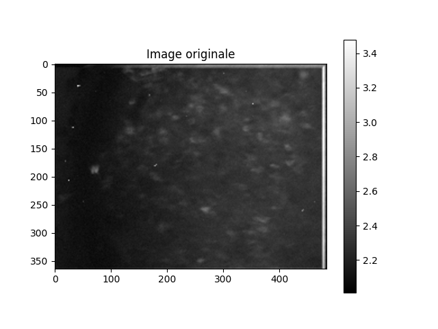
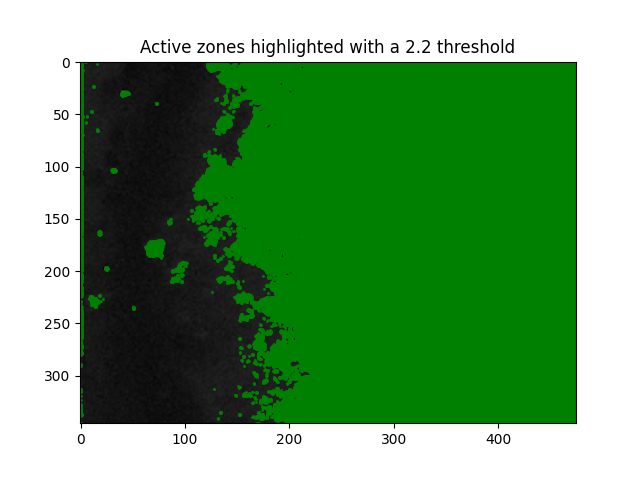
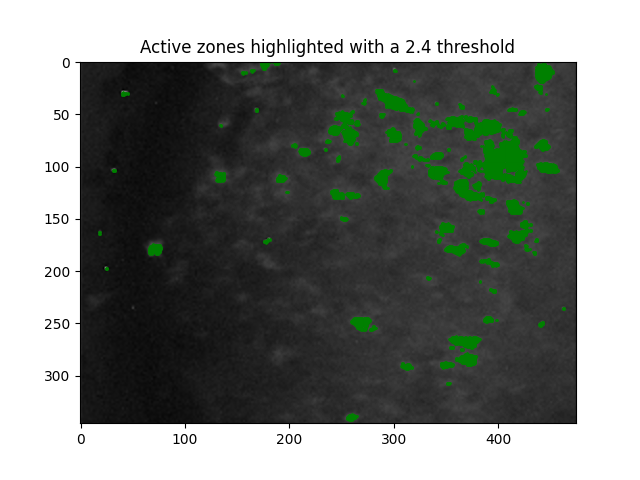
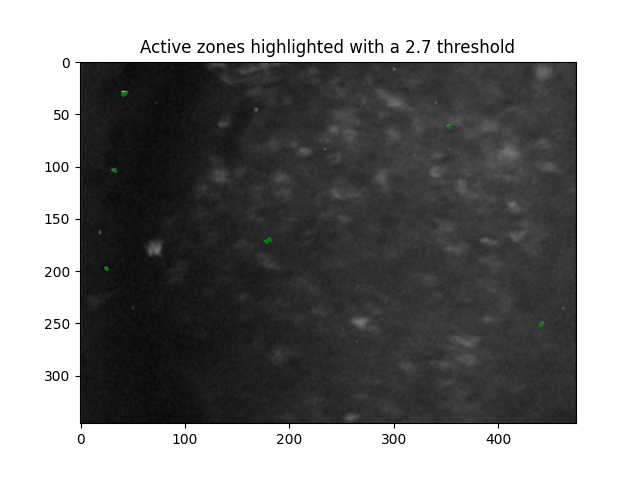
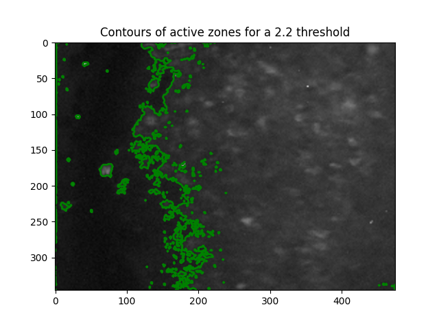
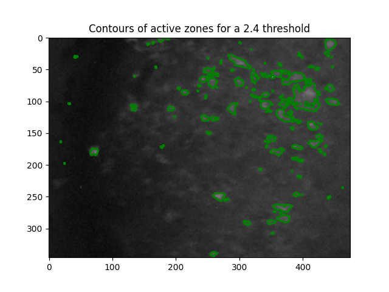
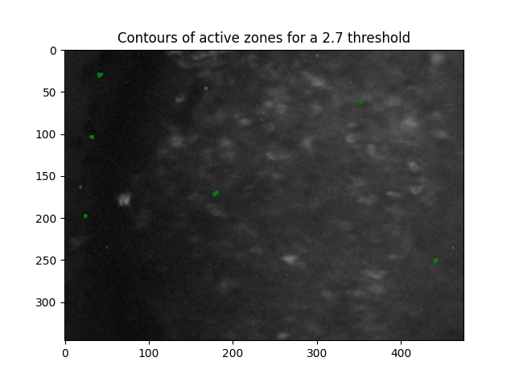

# ImageProcessing

Ce folder contient des fonctions pour le traitement d'image, en particulier pour détecter les zones d'activation d'un réseau neuronal.

## Fonctionnalités

### Chargement et conversion du fichier Excel

Le fichier Excel `data_image.xlsx` est chargé et converti en un tableau numpy. Ce fichier exemple contient les données d'une image en teintes de gris représentant un réseau neuronal.

### Fonctions principales
  
- **show_active_zones(image, threshold)** : Montre les zones actives en vert sur l'image pour un seuil donné.

- **show_contours(image, threshold)** : Affiche les contours des zones actives sur l'image pour un seuil donné.

- **find_most_active_zones(image, threshold, grid_size)** : Trouve et retourne les coordonnées des zones les plus actives parmi les zones définies par la grille.

## Résultats pour différents seuils

### Détection des zones d'activation

#### Seuil 2.2

#### Seuil 2.4

#### Seuil 2.7

### Contours des zones les plus actives

#### Seuil 2.2

#### Seuil 2.4

#### Seuil 2.7

