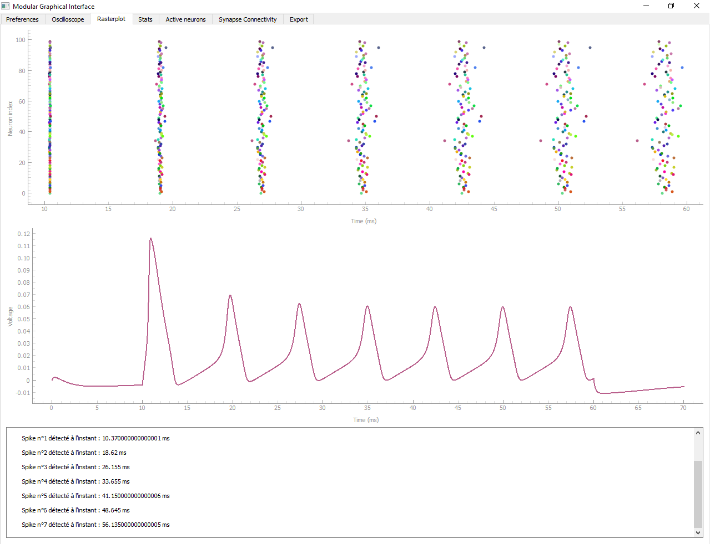
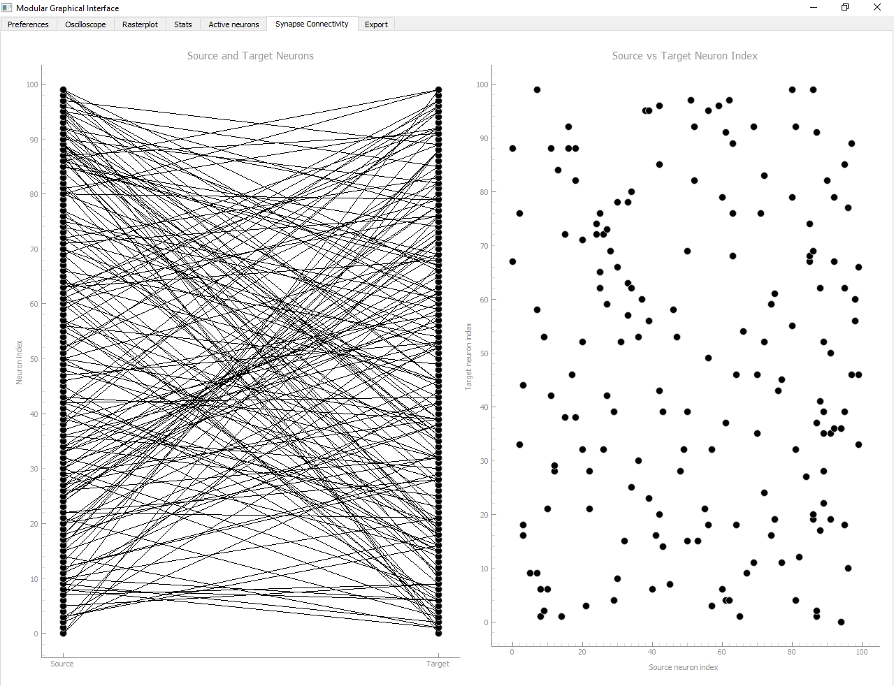

# ModularGUI_Brian2

Ce répertoire contient le code pour le développement d'une interface graphique utilisant Brian2 pour simuler et analyser l'activité neuronale.

## Contexte

Cette interface graphique a été développée pour permettre la simulation d'un réseau neuronal suivant le modèle de Hodgkin-Huxley ainsi que sa visualisation au travers d'une interface graphique dynamique. Différentes fenêtres ont été implémentées, permettant la visualisation de différents graphes d'analyse. 

## Informations générales

L'interface peut mettre un certain temps à afficher l'interface, notamment selon le nombre de neurones choisi.

**Le graphique du MFR n'est pas complet, le code actuel permet seulement de compter le nombre de décharges par neurone.**

## Détails du contenu

#### Fenêtre sur laquelle le rasterplot s'affiche

Il est possible de cliquer sur les points du rasterplot afin d'afficher le potentiel membranaire correspondant.

#### Fenêtre présentant la connectivité synaptique

