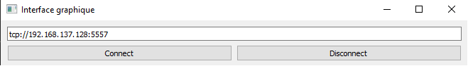
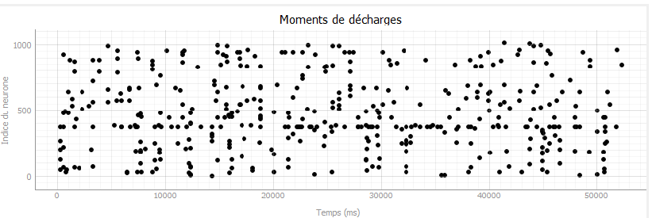
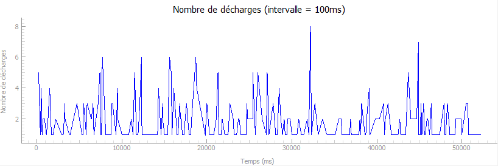
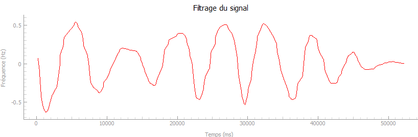

# Interface Graphique de Visualisation en Temps Réel

Ce projet implémente une interface utilisateur graphique (GUI) en utilisant PyQt5 pour visualiser les données d'une carte FPGA. Le système capte les données via une socket ZeroMQ.

## Introduction

Cette interface graphique a été développée pour permettre la visualisation en temps réel des données collectées par une carte FPGA. Elle fournit des outils pour analyser les moments de décharges neuronales et les fréquences de ces décharges, ainsi que pour filtrer ces données selon les ondes alpha. 

## Informations générales

L'interface peut mettre un certain temps à afficher les courbes de fréquences de décharges et de filtre. Il se peut aussi que l'interface plante en raison du nombre de calculs à effectuer. Dans ce cas il faut relancer l'interface et une simulation avec la carte. 

## Fonctionnement

Pour faire fonctionner l'interface :

1. **Entrer l'adresse IP** :
   - Renseigner l'adresse IP dans la zone de texte.

2. **Lancer la simulation** :
   - Utiliser MobaXterm pour lancer la simulation.

3. **Se connecter** :
   - Cliquez sur le bouton "Connect" dans l'interface pour établir la connexion et commencer la visualisation des données.



## Détails du contenu

### Moments de décharges

La première courbe de l'interface permet de représenter les moments de décharges des neurones en fonction du temps.



### Fréquences de décharges

La seconde courbe permet de compter le nombre total de décharges pendant une durée de 100 ms et de l'afficher. L'affichage se fait selon la borne inférieure du temps. Par exemple, pour l'intervalle [100 - 199], l'affichage se fera au niveau de la borne 100.



### Filtrage

Le troisième graphe permet d'afficher le second graphe, mais filtré selon les ondes alpha, c'est-à-dire pour une fréquence comprise entre 8 et 12 Hz.



## Prérequis

Voici les bibliothèques nécessaires :

- PyQt5
- pyqtgraph
- numpy
- zmq
- scipy

Vous pouvez installer toutes les dépendances nécessaires avec la commande suivante :

```bash
pip install pyqt5 pyqtgraph numpy pyzmq scipy
```

## Installation

1. Clonez le dépôt :

```bash
git clone https://github.com/votre-utilisateur/votre-projet.git
cd votre-projet
```

2. Installez les dépendances :

```bash
pip install -r requirements.txt
```

## Utilisation

1. Lancez l'interface graphique :

```bash
python main.py
```

2. Suivez les instructions à l'écran pour visualiser les données en temps réel.

